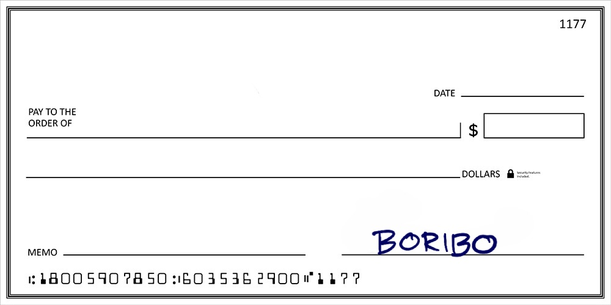
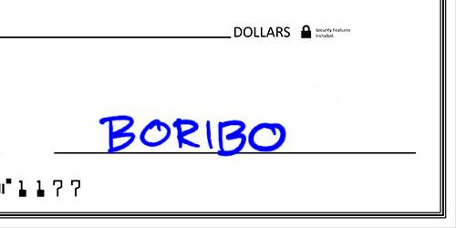
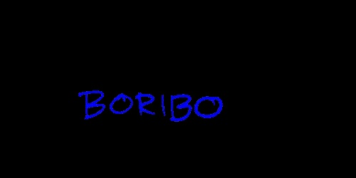
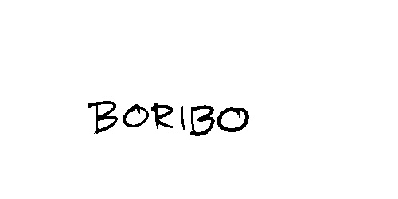

# Signature Verification for Checks

## Overview
This project develops a system to verify the authenticity of signatures on checks using image processing and machine learning techniques. The system processes check images, extracts signature features, and classifies them as genuine or forged using a Multi-layer Perceptron (MLPClassifier) from Scikit-learn. The project was completed as part of the "Machine and Deep Learning" course at the Autonomous University of Aguascalientes in February 2025.

## Features
- **Data Acquisition**: Collected a dataset of 107 check images from 7 individuals (15 signatures each, plus 2 forged signatures). All signatures are synthetic and do not contain real personal information.
- **Preprocessing**: Enhanced image saturation using PIL, cropped the signature region (bottom-right corner), applied a blue color mask, and binarized the images to isolate the signature.
- **Feature Extraction**: Used morphological operations (erosion and dilation) with 54 structural elements to extract signature patterns, creating a dataset of structural element counts.
- **Dataset Augmentation**: Generated 205 synthetic patterns (50 positive, 155 negative) to improve model robustness, resulting in a total of 310 patterns.
- **Classification**: Trained an MLPClassifier (Scikit-learn) to distinguish genuine vs. forged signatures, achieving a global accuracy of 97.85%.

## Technologies Used
- Python
- PIL (Pillow) (for image enhancement)
- OpenCV (for image preprocessing and morphological operations)
- NumPy (for numerical operations and structural elements)
- Scikit-learn (for MLPClassifier and evaluation metrics)
- Pandas (for dataset handling)

## Project Structure
- `data/`: Contains the dataset and related files.
  - `ElementosEstructuralesEnFirmas.csv`: CSV file with the structural element counts for the signatures.
  - `signatures/`: Directory containing the 107 synthetic check images (105 genuine, 2 forged).
- `docs/`: Contains documentation and reports.
  - `FO-121500-10-EXAMEN_1_A1_CJ_Feb_2025.pdf`: Final project report in PDF format.
  - `FO-121500-10-EXAMEN_1_A1_CJ_Feb_2025.html`: HTML export of the Jupyter Notebook.
- `notebooks/`: Contains Jupyter Notebooks.
  - `FO-121500-10-EXAMEN_1_A1_CJ_Feb_2025.ipynb`: Jupyter Notebook with the project code and analysis.
- `requirements.txt`: Lists the required Python libraries.
- `README.md`: Project overview and instructions.
- `LICENSE`: MIT License file.

## Installation
1. Clone the repository:
   ```bash
   git clone https://github.com/Cgrbono14/Signature-Verification-Check.git

2. Install the required dependencies:
   ```bash
   pip install -r requirements.txt

3. (Optional) If you want to test with your own check images, place them in the data/signatures/ directory.

4. Run the Jupyter Notebook to execute the project:
   ```bash
   jupyter notebook notebooks/FO-121500-10-EXAMEN_1_A1_CJ_Feb_2025.ipynb

## Configuration
The Jupyter Notebook (notebooks/FO-121500-10-EXAMEN_1_A1_CJ_Feb_2025.ipynb) contains file paths that were specific to the original development environment. You may need to adjust these paths to match your local setup. Specifically:

- **Image Directory**: The notebook may reference a directory for loading the check images (e.g., /path/to/signatures/ on the original machine). Update this path to point to data/signatures/ in the cloned repository, or to the location of your own images if you are using a different dataset.
- **Output Files**: If the notebook saves output files (e.g., processed images or results), ensure that the output directories exist on your machine, or modify the paths to a suitable location.

To update the paths:

1. Open the notebook in Jupyter.
2. Search for any file paths (e.g., using os.path or hard-coded strings like /path/to/signatures/).
3. Replace them with the correct paths for your environment. For example, if the notebook uses a path like /home/user/signatures/, change it to data/signatures/ (relative to the repository root).

## Results
- **Dataset**: 107 synthetic signatures (105 genuine, 2 forged), augmented with 205 synthetic patterns (50 positive, 155 negative), for a total of 310 patterns. The structural element counts are available in data/ElementosEstructuralesEnFirmas.csv.
- **Model Performance**:

  - Global Accuracy: 97.85%
  - Global Error: 2.15%
  - Confusion Matrix: [[43, 2], [0, 48]]
  - Precision per Category: Genuine (YES): 100%, Forged (NO): 95.56%

- **Test Results**: Correctly classified 2 genuine signatures ("SI") and 2 forged signatures ("NO") (100% accuracy on test set).

## Example Output
Below is an example of the signature processing pipeline:

- **Original Check**:

  

- **Cropped Bottom-Right Corner**:

  

- **Blue Mask Applied (Signature Isolated)**:
 
  

- **Binarized Image**:

  

## License
This project is licensed under the MIT License - see the  file for details.
